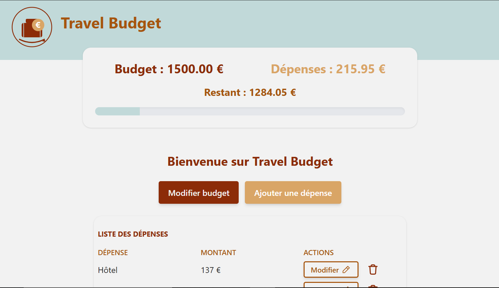

# Travel Budget



**Travel Budget** est une application React moderne conçue pour aider les voyageurs à planifier et suivre leurs dépenses en temps réel. L'interface offre un retour visuel immédiat sur l'état des finances grâce à un résumé dynamique et une barre de progression.

---

## Fonctionnalités

* **Gestion de Budget** : Définition et modification d'un budget total.
* **Suivi des Dépenses** : Ajout, modification et suppression de dépenses avec mise à jour instantanée des totaux.
* **Visualisation Dynamique** : 
    * Calcul automatique du budget restant avec indicateurs de couleur.
    * Barre de progression qui change de couleur selon le budget restant.
* **Responsive Design** : Interface fluide et optimisée pour mobile et desktop via Tailwind CSS.

## Stack Technique

* **React 19** : Utilisation des Hooks (`useState`, `useNavigate`).
* **React Router** : Gestion de la navigation.
* **Tailwind CSS**

## Installation et Lancement

1.  **Cloner le projet** :
    ```bash
    git clone git@github.com:geraldine1989/travel-budget.git
    cd travel-budget
    ```

2.  **Installer les dépendances** :
    ```bash
    npm install
    ```

3.  **Lancer l'application** :
    ```bash
    npm run dev
    ```